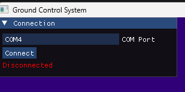
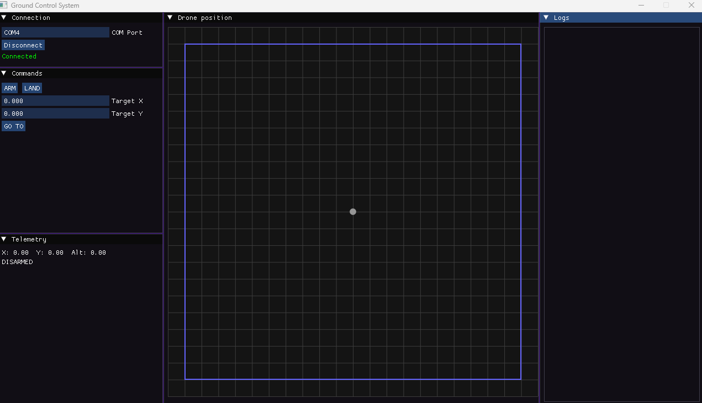
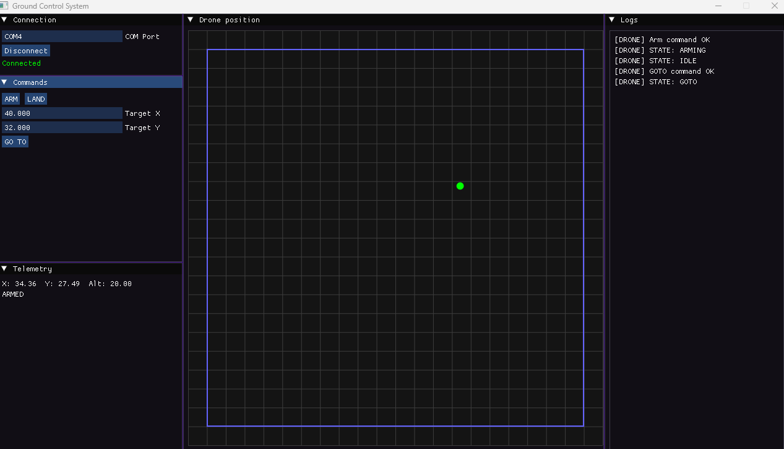

## Asynchronous Drone Client Server
A simple client-server application between Drone microcontroller (STM32 Nucleo F411RE board) and 
Ground Control System (desktop application). Simulates basic drone operations through serial communication over UART/COM.

## Repository structure
```
asyncDC/
├── firmware/ - Firmware root directory
│   ├── inc/
│   │   ├── tasks.h - Header for task components
│   │   ├── dcs_type.h - Structs used in task operations
│   │   └── ...
│   ├── src/
│   │   ├── comm_task.cpp - Communication task source file
│   │   ├── control_task.cpp - Control task source file
│   │   ├── freertos.c - Freertos task/mutex/etc
│   │   ├── main.c - Custom HAL function overrides for tasks
│   │   └── ...
│   ├── CMakeLists.txt - Firmware CMakeLists (ARM_GCC)
│   ├── firmware.ioc - IOC file (CubeMX)
│   └── ...
│
├── gcs/ - Ground Control Station directory
│   ├── inc/
│   │   ├── gcs_comm.h - Communication header
│   │   └── gcs_ui.h - UI header
│   ├── src/
│   │   ├── gcs.cpp - Main UI loop
│   │   ├── gcs_comm.cpp - Communication source code
│   │   └── gcs_ui.cpp - UI source code
│   ├── tests/
│   │   └── test_gcs.cpp - GCS test file
│   └── CMakeLists.txt - GCS CMakeFiles
│
├── integration_tests/
│   ├── test_integration.cpp - Integrated tests between GCS and Firmware (live hardware connection)
│   └── CMakeLists.txt - Integrated tests CMakeFiles
│
├── libs/ - Utilities directory
│   ├── dcs_protocol/ - Communication protocol directory
│   │   ├── inc/
│   │   │   └──protocol.h - Protocol header
│   │   ├── src/
│   │   │   └──protocol.cpp - Protocol source code
│   │   └── tests
│   │   │   └──test_protocol.cpp - Protocol tests
│   │   └── CMakeLists.txt - Protocol CMakeLists
│   │
│   ├── drone_application/ - Drone application logic directory
│   │   ├── inc
│   │   │   └──drone.h - Drone logic header
│   │   ├── src
│   │   │   └──drone.cpp - Drone logic source file
│   │   └── tests
│   │   │   └──test_drone.cpp - Drone logic tests
│   │   └── CMakeLists.txt - Drone logic CMakeFiles
│   ├── config/
│   │   └── inc/
│   │       └── geofence.h - Shared geofence parameters
│   ├── imgui/
│   ├── googletest/
│   └── glfw/
│
├── CMakeLists.txt - Root CMakeLists
├── docs/ - Image directory for README
└── README.md
```
## Submodules
Dependencies [ImGui](https://github.com/ocornut/imgui), [Google Tests](https://github.com/google/googletest/) and [GLFW ](https://github.com/glfw/glfw)are listed as submodules under /libs/.

Cloning repository:
```
git clone --recurse-submodules https://github.com/aek-g/asyncDC.git
```

## Build instructions
### GCS
- OS: Windows 
- C++ version: 20+    
- CMake version 4.3+

#### MSVC
In project root:
```
cmake -S . -B build-msvc

cmake --build build-msvc
```
Executables should be compiled to 
```
build-msvc/{executable/directory/path}/Debug/{executable}.exe
```
Example - Drone application tests
```
build-msvc/libs/drone_application/Debug/drone_tests.exe
```
Executables can be run in terminal.

#### G++
In project root:
```
cmake -S . -B build-gcc -G "MinGW Makefiles"

cmake --build build-gcc
```

Executables should be compiled to
```
build-gcc/{executable/directory/path}/{executable}.exe
```
Example - Drone application tests
```
build-gcc/libs/drone_application/drone_tests.exe
```
Executables can be run in terminal.

### Firmware
- Suggested: [STM32CubeMX](https://www.st.com/en/development-tools/stm32cubemx.html)  
- Required: [STM32CubeCLT](https://www.st.com/en/development-tools/stm32cubeclt.html) (or equal toolset)  
- C++ version: 20+       
- Compiler: ARM GCC (bundled in CubeCLT)

Verify requirements:
```
arm-none-eabi-gcc --version
ninja --version
STM32_Programmer_CLI.exe --version
```
In /firmware/:
```
cmake -S . -B build -G "Ninja" -DCMAKE_TOOLCHAIN_FILE="$PWD/cmake/gcc-arm-none-eabi.cmake"
cmake --build build
```
(Might differ depending on gcc-arm-none-eabi setup)

firmware.elf should be compiled in:
```
firmware/build/firmware.elf
```

In /firmware/ verify size and flash:
```
arm-none-eabi-size .\build\firmware.elf
STM32_Programmer_CLI.exe  -c port=SWD -d ".\build\firmware.elf" -rst
```
The Nucleo Debugger LED should flash for a few seconds.

## Running tests
MSVC build:
```
build-msvc\libs\dcs_protocol\Debug\protocol_tests.exe

build-msvc\libs\drone_application\Debug\drone_tests.exe

build-msvc\gcs\Debug\gcs_tests.exe
```
G++ build:
```
build-gcc\libs\dcs_protocol\protocol_tests.exe

build-gcc\libs\drone_application\drone_tests.exe

build-gcc\gcs\gcs_tests.exe
```
(If nothing is returned, check \msys64\ucrt64\bin path variable)

For integration tests the firmware MUST be flashed and connected. In device manager,
see which COM port the STM32 is connected to, then set that as the DRONE_PORT (default COM4) in test_integration.cpp and REBUILD.

MSVC build:
```
build-msvc\integration_tests\Debug\gcs_integration_tests.exe
```

G++ build:
```
build-gcc\integration_tests\gcs_integration_tests.exe
```

## Running GCS

If firmware is flashed and all tests passed, try running GCS and connecting on the correct COM port.   

MSVC build:
```
build-msvc\gcs\Debug\gcs.exe
```

G++ build:
```
build-gcc\gcs\gcs.exe
```
You should see the GCS window open, with only Connection tab visible:



Insert your COM port and press the Connect button.
Connection should be successful and you should see Commands, Telemetry, Drone position and Logs panels appear:



### Commands
- ARM - Drone will arm and ascend to 20m altitude.    
- LAND - Drone will land in current position.     
- GO TO - Drone will move to inserted coordinates

### Drone position
On startup, the drone is disarmed (gray) in the center. When armed, it will turn green. Successful GoTo commands will be
reflected on the 2D display. Drone should not leave geofence (blue border).



### Telemetry and logs
Real-time telemetry should be displayed in Telemetry panel. All state changes, command responses and errors should be displayed in Logs panel.

### LED states
Each state is shown via LD2 (green) on the board. For movement based states, the LED is blinking, while for static states the LED is ON/OFF:   

- DISARMED - Off  
- ARMING - Blinking   
- IDLE - Solid on   
- GOTO - Blinking     
- LANDING - Blinking  

## Known limitations

- Landing via Nucleo button press is testable manually, not included in test files.
- COM port physical disconnect behaviour is not fully validated due to observed debugger initiated reboot on COM reconnect.
- Changing default shared geofence.h values in /libs/conf may result in unexpected UI behaviour. This is not currently advised for GCS use.
- GCS unit tests are carried out on available gcs_comms elements, due to io_thread and connection logic restrictions.
- GCS UI window size and element layout is fixed to ensure standard behaviour.
- Integration tests are order dependant and connected STM32 COM port must be manually entered to DRONE_PORT, then rebuilt.
- Protocol XOR checksum is blind to swapped bytes inside payload.
- std::byte was used throughout the project for type safety, which created many static_cast instances between types.

## Architecture decisions
### Project structure
The project was started from the protocol directory, which after implementation was moved to a new root folder under /libs/ as a utility. For testing, 
Google Tests was included in /libs/ as a submodule. Due to the separation requirement of drone application logic from hardware specific code, drone application logic was also implemented 
under /libs/. 

Firmware libraries and code were generated into /firmware/ using CubeMX, to separate hardware specific code from the project. 
After firmware implementation, /gcs/ directory was made in root, to match /firmware/ separation logic. ImGui and GLFW were included as submodules in /libs/.
Each separately testable or compilable module included a separate CMakeLists.txt, with the root CMakeLists owning all other instances except /firmware/CMakeLists.txt, since
that required ARM GCC compiler. After UI implementation, /integration_tests/ was created to separate the test environment for integrated tests.


### Protocol
For the protocol, a simple byte based structure was chosen with XOR checksum verification, because of byte level logic and XOR simplicity. 
For type safety during byte operations, std::byte was used in protocol instead of uint8_t, becoming the standard for byte operations in most modules.
This caused a lot of static_cast to be used later on, leading to the final opinion that choosing std::byte was a misstep in development.
The protocol message length was based on the second byte MsgType, which set a hardcoded length for the whole message via rigid payload structure. This was chosen due to simplicity and robustness.

### Drone application logic

DroneController was created as a class to use all necessary private and public members in one structure. The landing logic was changed from
fixed velocity 10m/s to slower, more realistic behaviour due to requirement "gently land". 

### Hardware code
In CubeMX, FreeRTOS with CMSISv2 (over CMSISv1) was used. Communication Task and Control Task were created separately, with larger default stack size for headroom. Control Task was upgraded to
osPriorityAboveNormal in late development for being the safety critical task and ensuring future proofing (against additional tasks, purely theoretical showcase). Two queues were made for commands and logs with 0 timeout Put/Get, so either task would not stall while waiting for the other.

A mutex with priority inherit (added later with priority change) was created for DroneController class instance, owned by ControlTask. For button enabled landing, a HAL interrupt callback was added to main.c and NVIC Interrupt table value was enabled. HAL UART RX with interrupt was created for
Communication Task, so RX would not have to be manually polled every loop. For this, a callback along with UART error callback was created in main.c and NVIC interrupt table value was enabled. Both NVIC values were enabled as original 5, but updated to 6 when hardware testing showed they hung the system.

### GCS
GCS communication code mirrored the drone communication task logic, with same principles applied. Communication was separated from main GUI thread
with io_thread, however that led to complications for standalone unit testing, with separate testing constructor and functions being created for unit tests. For
data transfer between the two threads, a command mutex (for queued commands) and state mutex (for telemetry and logs) were created.
GCS UI was created with the basic requirements list in mind. Fixed size of 1280x720p was chosen along with fixed elements, to guarantee UI standard layout across devices. A simple grid display was chosen for understandable drone position estimation.